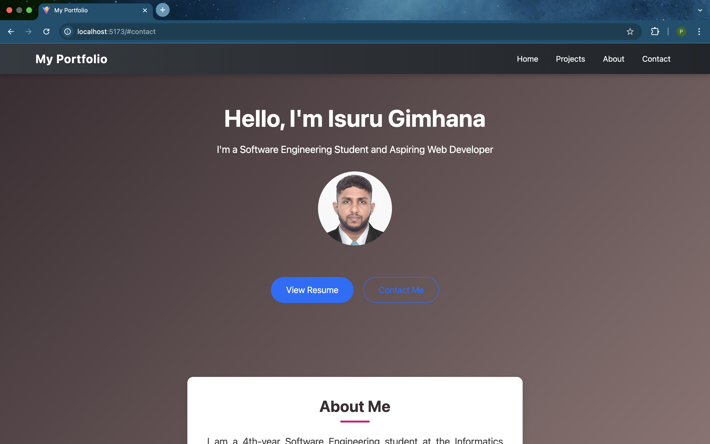

# My Portfolio

A personal portfolio website built with **React**, **Vite**, and **React Bootstrap**.  
It showcases my projects, skills, and contact information in a clean and responsive design.

---

## Live Demo
[View Live Demo](https://your-live-demo-link.com)  



---

## Features
- Responsive navbar with smooth scrolling
- Projects section with interactive project cards
- About section highlighting personal details
- Contact form integrated with **EmailJS**
- Toast notifications for successful/failed form submission
- Fully responsive design for all screen sizes

---

## Tech Stack
- [React](https://reactjs.org/)
- [Vite](https://vitejs.dev/)
- [React Bootstrap](https://react-bootstrap.github.io/)
- [Bootstrap](https://getbootstrap.com/)
- [EmailJS](https://www.emailjs.com/)

---

## Installation

1. Clone the repository

```bash
git clone https://github.com/IsuruGimhana/my-portfolio.git
```
2. Navigate into the project directory

```bash
cd my-portfolio
```
3. Install dependencies

```bash
npm install
```
4. Start the development server

```bash
npm run dev
```
5. Open your browser at http://localhost:5173 (default Vite port)

---

## Folder Structure

## Folder Structure
```text
my-portfolio/
│── public/
│── src/
│   ├── assets/
│   ├── components/
│   ├── pages/
│   ├── styles/
│   └── App.jsx
│── package.json
│── README.md

